# Começando os testes com a alteração do número de neurônios na camada intermediária

## Usando 2:

Loss teste: 0.19960379600524902
Accuracy teste: 0.9666666388511658

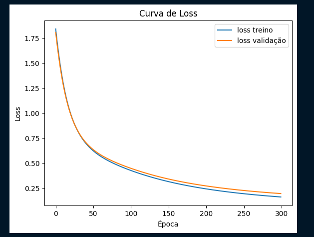

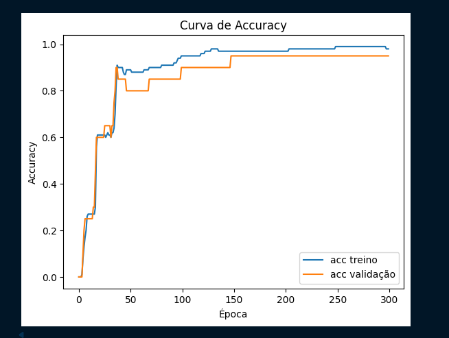

## Padrão (4 neurônios):

Loss teste: 0.2750205099582672
Accuracy teste: 0.8999999761581421

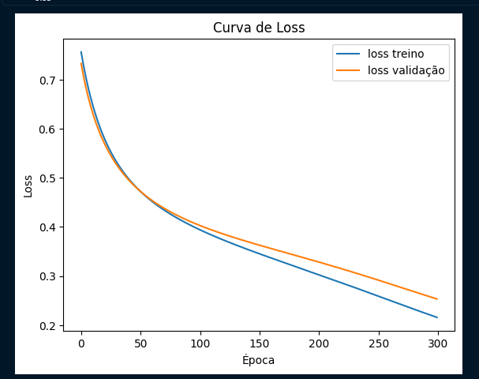

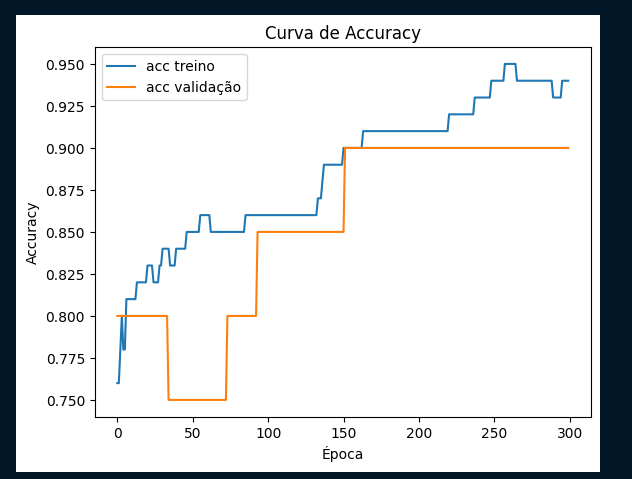

## Usando 8:

Loss teste: 0.18322578072547913
Accuracy teste: 0.9333333373069763

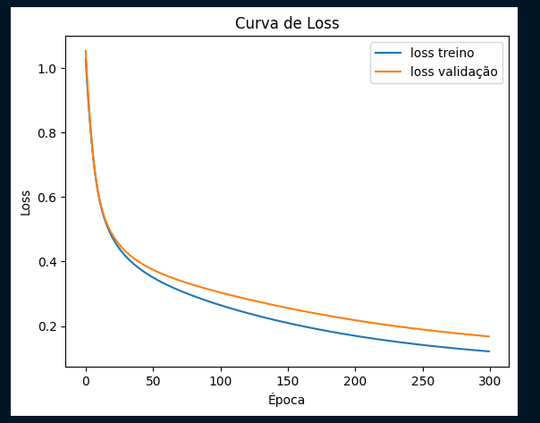

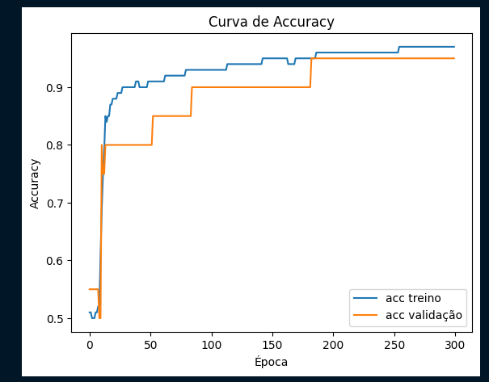

## Usando 16:

Loss teste: 0.17430207133293152
Accuracy teste: 0.9333333373069763

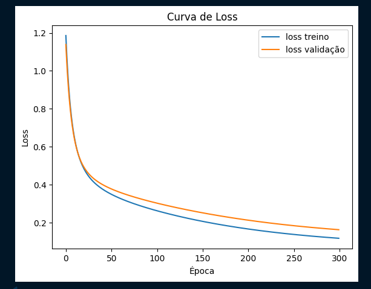
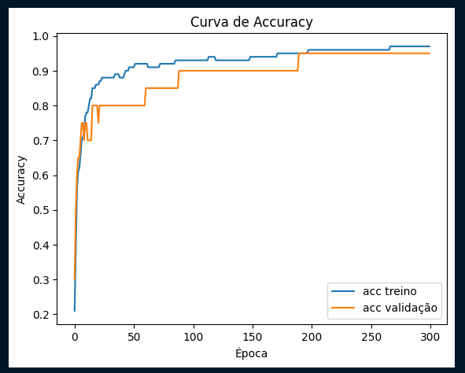

## Usando 32:

Loss teste: 0.150993213057518
Accuracy teste: 0.9333333373069763

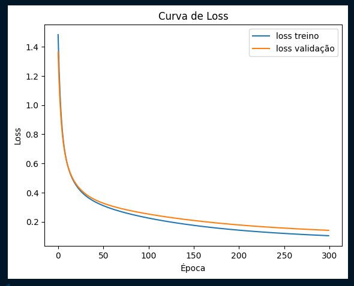
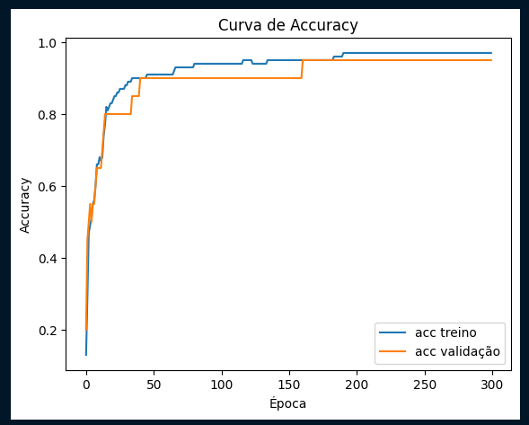

## Usando 64:

Loss teste: 0.14442063868045807
Accuracy teste: 0.9666666388511658

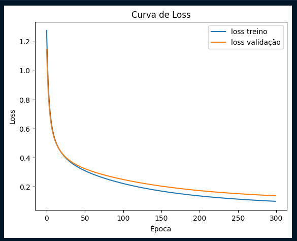
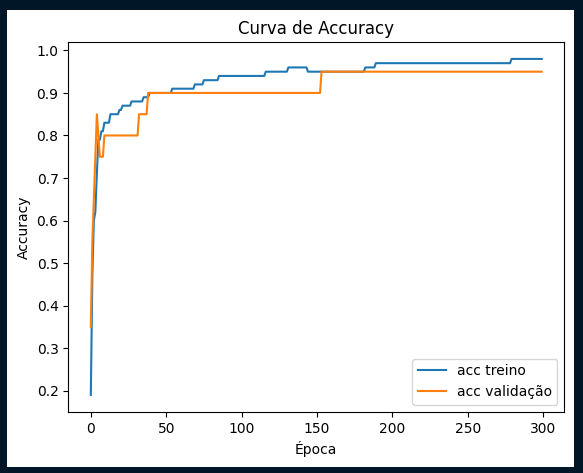

Observações: Por algum motivo a melhor accuracy foi obtida com o menor valor de neurônios na camada intermediária, talvez seja por conta do dataset ser simples. Contudo, a métrica de loss foi aprensentando discretas melhorias conforme a camada intermediária tinha mais neurônios. Talvez ter mais neurônios ajude a errar menos enquanto aprende?

# Usando 64 neurônios por ter apresentado a melhor métrica de loss (e por que é mais legal)

## Usando 100 épocas

Loss teste: 0.4651843011379242
Accuracy teste: 0.7666666507720947

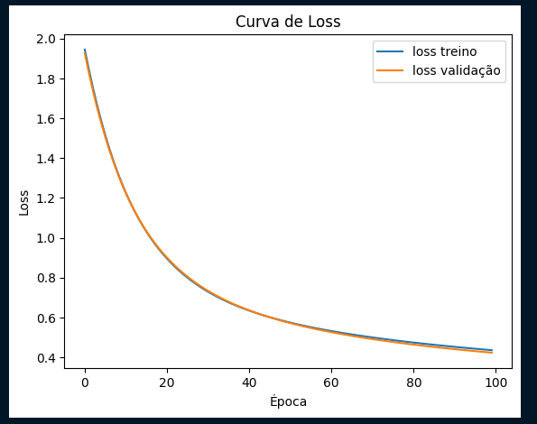
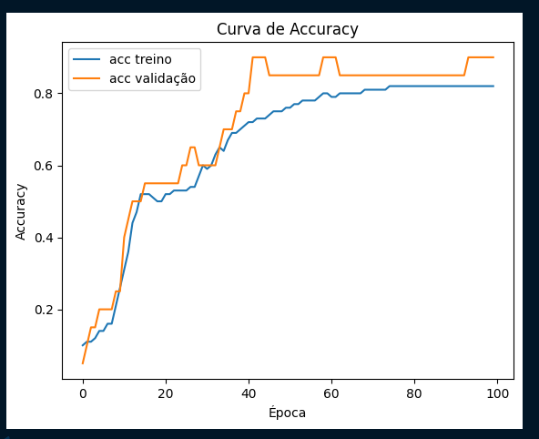

## Usando 200 épocas

Loss teste: 0.17845426499843597
Accuracy teste: 0.9666666388511658

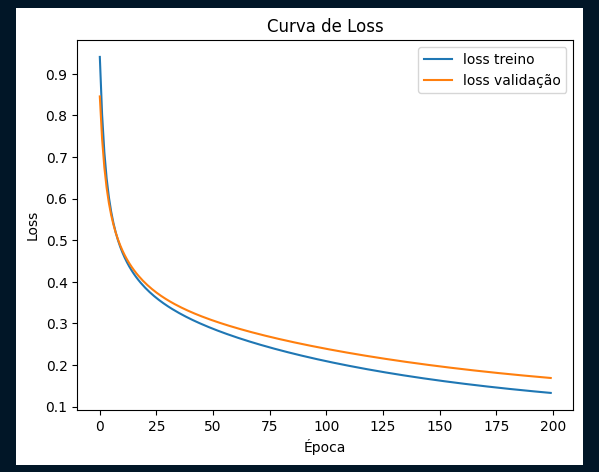
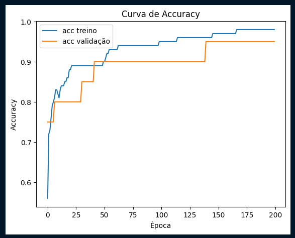

## Usando 300 épocas

Loss teste: 0.1476723998785019
Accuracy teste: 0.9666666388511658

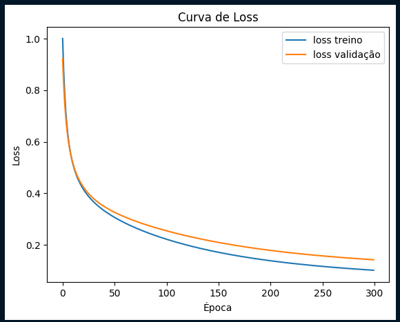
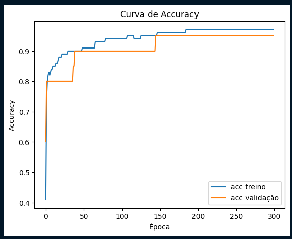

## Usando 400 épocas

Loss teste: 0.13463973999023438
Accuracy teste: 0.9333333373069763

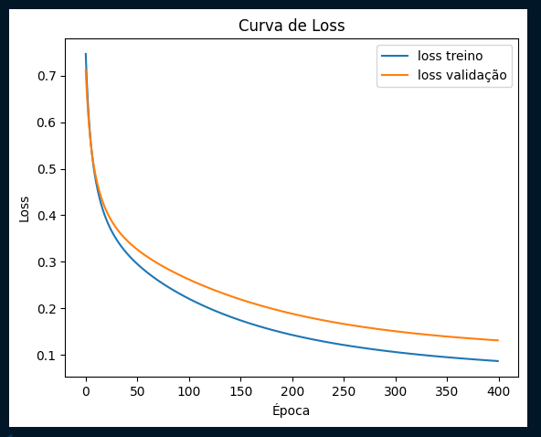
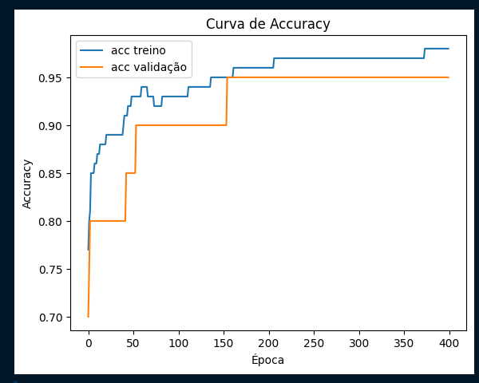

## Usando 500 épocas

Loss teste: 0.1099945455789566
Accuracy teste: 0.9666666388511658

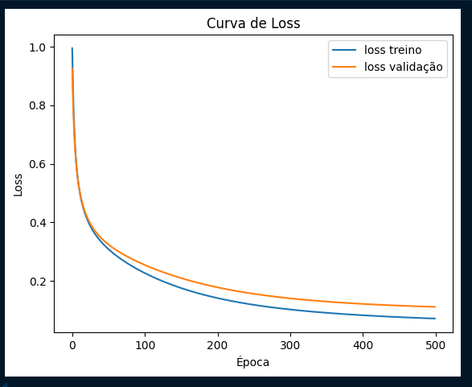
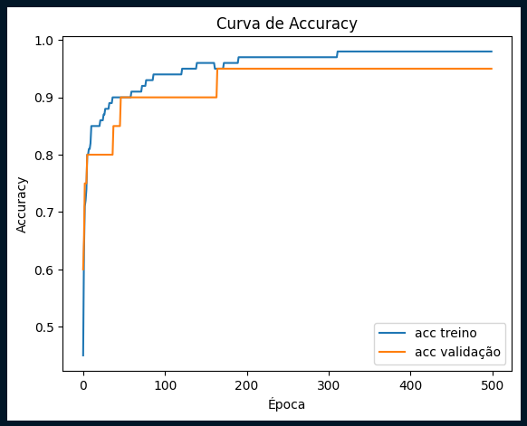

## Usando 600 épocas

Loss teste: 0.10275084525346756
Accuracy teste: 0.9666666388511658

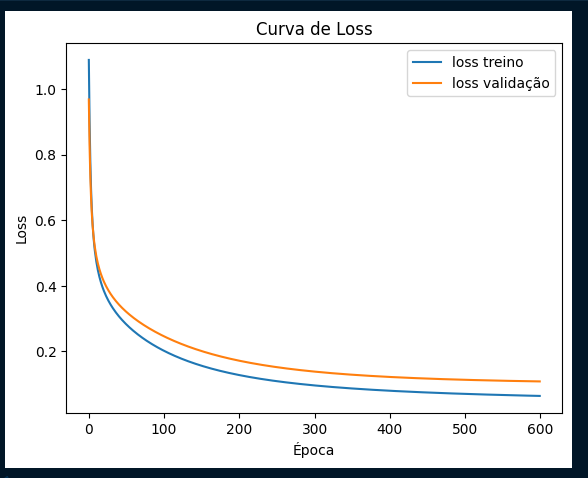
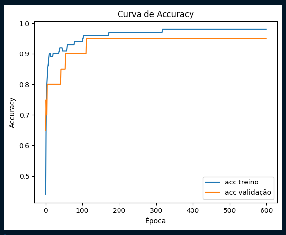

## Observações:

A quantidade de épocas parece influenciar o tempo que a rede tem para aprender. Um número abaixo do necessário, produz resultados insatisfatórios. A partir de 500 épocas a rede parece ter atingido um bom nível de aprendizagem, já que a variação das métricas de loss e accuracy deixaram de apresentar mudanças significativas.

# Usando 64 neurônios e 500 épocas, alterando o batch_size

## batch_size == 100:

Loss teste: 0.3088298738002777
Accuracy teste: 0.8333333134651184

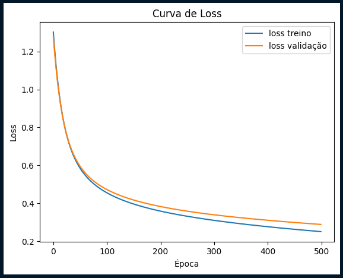
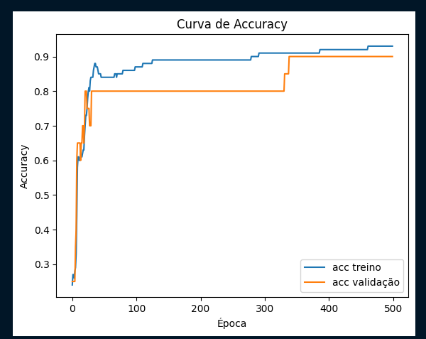

## batch_size == 50:

Loss teste: 0.23234882950782776
Accuracy teste: 0.8999999761581421

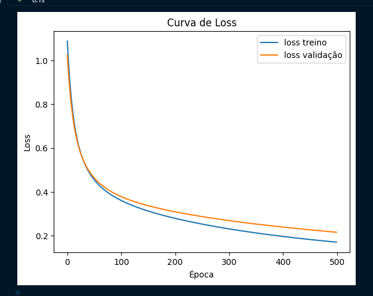
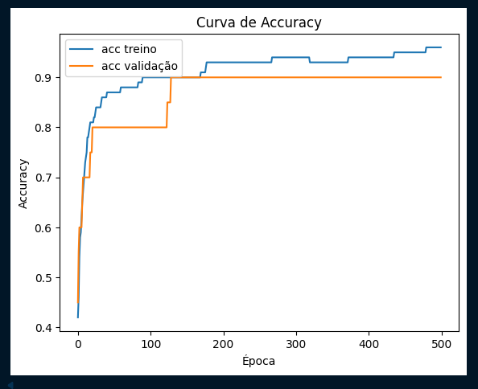

## batch_size == 25:

Loss teste: 0.1626475751399994
Accuracy teste: 0.9333333373069763

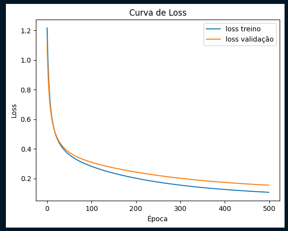
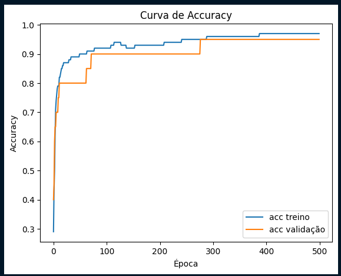

## batch_size == 12:

Loss teste: 0.10979873687028885
Accuracy teste: 0.9333333373069763

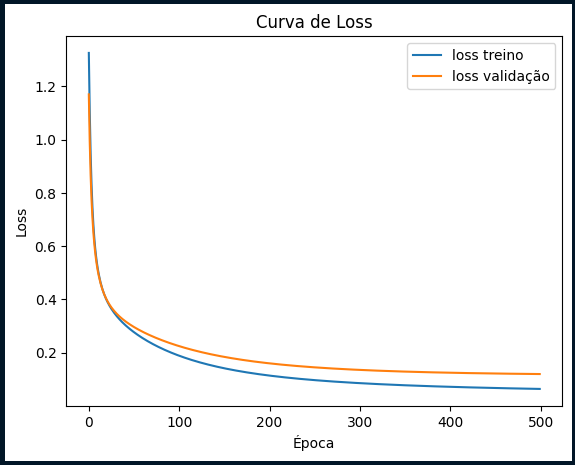
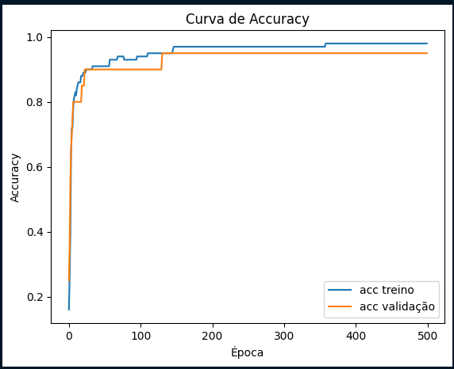

## batch_size == 6:

Loss teste: 0.0814267098903656
Accuracy teste: 0.9666666388511658

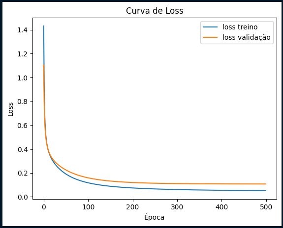
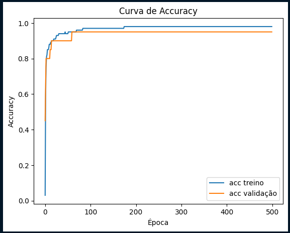

## batch_size == 1 (pela emoção):

Loss teste: 0.05820443481206894
Accuracy teste: 0.9666666388511658

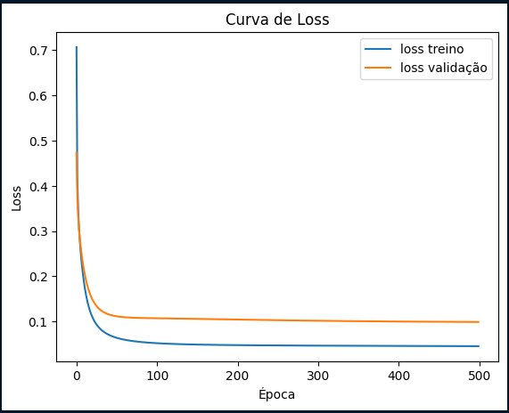
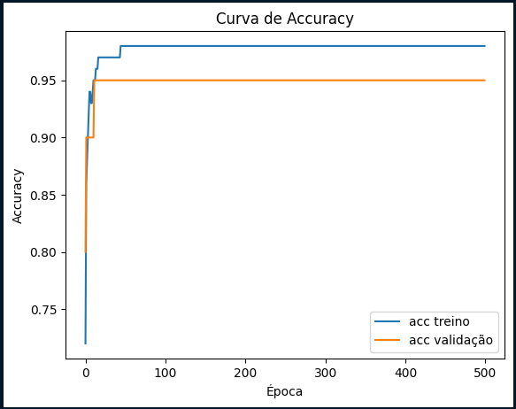